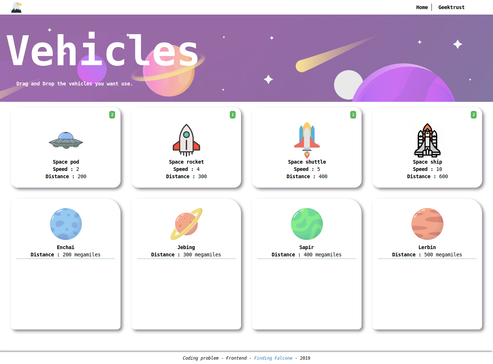

The Application is built on Angularjs framework.The simplest way To run the application is to
start a live server(python simple server or atom live server).The live demo of the application
can reached at https://bhrthkshr.github.io/finding_falcone/#!/

1. Select the planets you want to search in for AI falcone.
    - you can Select any four planets out of six planets
2. Drag and Drop the vehicle you want to use to send to the planets you selected.
    - The units of each vehicle type vary.
    - All have different ranges (maximum distance it can travel).
    - If the range for a vehicle is lesser than the distance to the planet, it
         cannot be chosen for going to the planet.
         
Screenshots:
1.Main page and Instructions

2.Planets and Selecting any 4 planets out of 6.

3.Vehicles and Selecting the vehicles by dragging and droping on to the desired planet.

4.Result Page

Image Credits:
1. Freepik - https://www.freepik.com
2. Uihere - https://www.uihere.com
